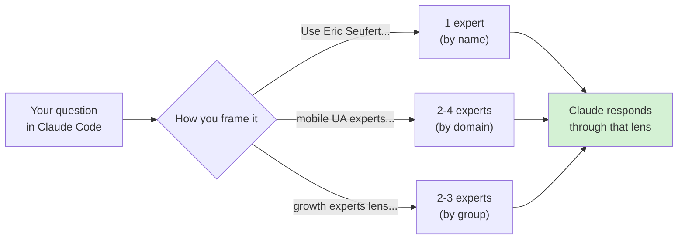
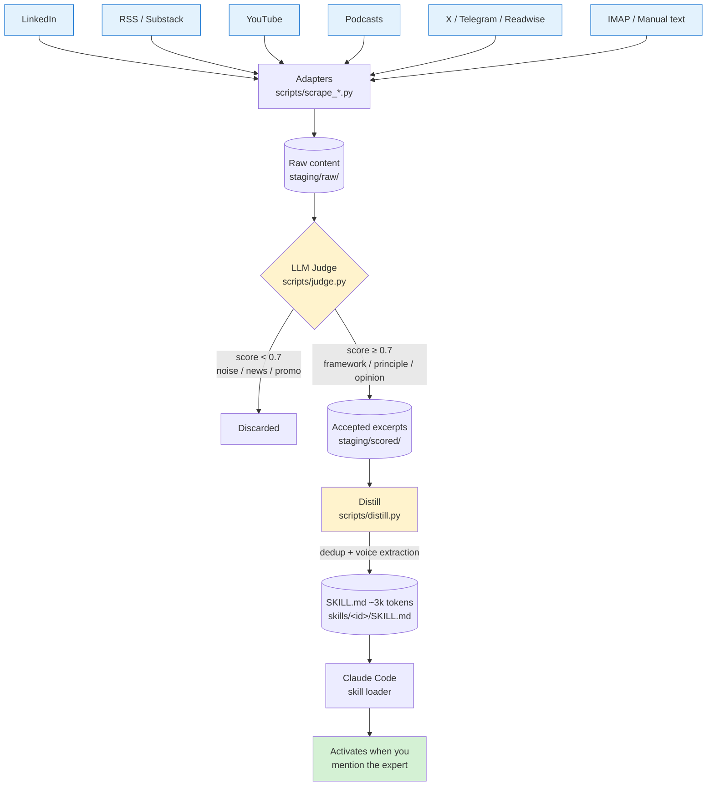

# Expert Mind Skill

> **A rotating circle of 21 named experts living inside your Claude Code.**
> Mention an expert by name, by domain, or by group — Claude answers through
> their frameworks, principles, and voice. Auto-refreshes weekly from
> LinkedIn, RSS, YouTube, podcasts.



---

## Why this exists

You follow great operators on LinkedIn, podcasts, Substack. Their frameworks
shape how you think. But when you actually need one of those frameworks — at
midnight, mid-decision, in a meeting — **you don't have their voices in your
head. You have their posts in a tab you never reopened.**

The information is accessible. The recall is not. This plugin fixes the
recall layer: it summons distilled expert thinking on demand, in the
expert's actual voice, with their frameworks intact.

---

## What you can do with it

### 1. Decision support before commitment

> *"Use Rory O'Driscoll — at our ARR, is now the right time to raise Series B,
> or should we focus on Rule of 40 for two more quarters?"*

Get a structured answer through a SaaS-VC's framework before the board meeting,
not after.

### 2. Borrow expert framing for your own writing

> *"I'm drafting a memo on cohort financing for mobile apps. Use Eric Seufert's
> framing — economic-historical, with concrete dollar examples."*

The skill includes voice samples — characteristic phrasing, not just topics.

### 3. Multi-perspective without scheduling four calls

> *"Give me 3 expert perspectives on whether to launch a referral program —
> growth lens, brand lens, monetization lens."*

Activates three different personas in parallel. Each answers in their own
section, no synthesis.

### 4. Stay current without doomscrolling

The weekly cron pulls fresh content automatically. **You don't need to
remember to read.** New frameworks from your tracked experts land in
the skill, ready to invoke.

### 5. Use as a research starter

> *"Before I write my position paper on AI in advertising — what do Eric
> Seufert, Andrew Chen, and Andrej Karpathy think about this space?"*

Three lenses in one prompt. You write the paper; the experts surface
relevant prior thinking.

---

## Who it's for

- **Founders & investors** making strategic decisions in mobile apps, B2B
  SaaS, growth, monetization
- **Operators & PMs** at growth-stage companies who want senior frameworks
  without senior salaries
- **Builders** who follow named thinkers but suffer from "I read this and
  I know it's relevant but I can't remember the specifics"
- **Forkers** who want to bundle their own expert circle (different domain,
  different language, different sources)

---

## Two install paths

### Path A — Just use the 21 bundled experts (zero config)

```bash
# Inside Claude Code
/plugin marketplace add github:mooreslaws/expert-mind-skill
/plugin install expert-mind-skill@expert-mind-skill
```

Done. All 21 experts are now active. **No API keys, no setup, no coding.**
Mention any of them and they activate.

### Path B — Add your own experts (interactive wizard)

```bash
/expert-mind-skill:init
```

A guided dialog walks you through everything. **No coding required.** The
wizard asks plain questions:

```
✅ LLM provider configured? (if not, paste an Anthropic API key)
✅ Which experts to add? (pick from 21 presets, or define your own)
✅ Which sources to pull from? (LinkedIn, RSS, X, YouTube, podcasts, …)
✅ Setup auto-refresh? (weekly cron, manual, or "just ping me in chat")
✅ Run the pipeline now?
```

You can exit anytime — every step is optional. Re-run `init` later to
continue where you left off. Filesystem-driven: the wizard inspects what
you already have configured and only asks what's missing.

---

## How to invoke an expert (3 patterns)

| Pattern | Example | Activates |
|---|---|---|
| **By name** | *"Use Eric Seufert — what's your take on cohort financing?"* | Exactly 1 expert |
| **By domain** | *"What do mobile UA experts think about Apple Search Ads?"* | 2-4 experts matching the domain |
| **By group** | *"Through growth experts lens — should we launch referral?"* | All experts in that group |

Available groups: `marketing`, `product`, `strategy`, `ai`, `finance`,
`leadership`, `design`, `sales`. Each expert is tagged with 1-3 groups.

**For parallel side-by-side answers** (no synthesis), say so explicitly:

> *"Give me 3 separate expert perspectives on X — don't synthesize, let each
> answer in their own section."*

---

## What's in the box (21 bundled experts)

Each skill: ~2-3k tokens of frameworks + principles + opinions + voice samples,
distilled from 80-120 LinkedIn/RSS/YouTube items per author.

| ID | Persona | Domain |
|---|---|---|
| `eric-seufert` | Eric Seufert | Mobile ad economics, ATT, AI distribution |
| `elena-verna` | Elena Verna | PLG, growth loops, retention |
| `andrew-chen` | Andrew Chen | Growth marketing, network effects |
| `anish-acharya` | Anish Acharya | Consumer fintech, AI investing |
| `rory-odriscoll` | Rory O'Driscoll | SaaS economics, public markets |
| `toddgardner1` | Todd Gardner | Bootstrapped SaaS, dev-tools marketing |
| `prestonr` | Preston Rutherford | DTC brand, anti-ROAS-only |
| `marcusburke` | Marcus Burke | Meta ads, value rules |
| `jacob-rushfinn` | Jacob Rushfinn | Mobile UA, creatives |
| `janvoss93` | Jan Voss | Paid UA, ASO |
| `dangjr` | Dan G Jr | Mobile growth |
| `sylvaingauchet` | Sylvain Gauchet | Growth Gems curation |
| `fazlurshah` | Fazlur Shah | Subscription apps |
| `dawidprokopowicz` | Dawid Prokopowicz | Mobile growth |
| `vkalmykov` | V. Kalmykov | Mobile growth |
| `mikolajbarczentewicz` | Mikolaj Barczentewicz | Mobile growth + product |
| `tomasz-tunguz` | Tomasz Tunguz | SaaS benchmarks, venture metrics |
| `jason-lemkin` | Jason Lemkin | SaaStr founder playbook, enterprise sales |
| `matej-lancaric` | Matej Lancarič | Mobile UA, creative testing |
| `chris-harvey` | Chris Harvey | Securities & regulatory law |
| `paul-levchuk` | Paul Levchuk | Product/retention analytics, cohorts, LTV |

Quality report: [output/EVALUATION_REPORT.md](output/EVALUATION_REPORT.md)
(21/21 with usable applicability, 0 fair-applicability).

---

# Technical description

Everything below is for people who want to **fork**, **add their own experts
via config files**, or **understand how the pipeline produces a skill**.
Skip if you just want to use the bundled set.

## How the pipeline works



**Every cadence cycle** (default: weekly):

1. **Ingest** — each enabled source adapter pulls latest content. RSS gets new
   posts since last sync; LinkedIn pulls last 100 posts via Apify; etc.
2. **Judge** — Claude scores each excerpt 0-1. Calibrated against
   [calibration_seed.md](calibration_seed.md) (50 labeled examples). Items
   ≥0.7 are kept. Errors surface loudly as `⚠️ ERRORS=N` in the run summary.
3. **Distill** — accepted items bucketed by type (framework / principle /
   opinion / voice sample), deduplicated semantically, written to a compact
   `SKILL.md` (target: 2-4k tokens, hard cap: 8k).
4. **Auto-refresh** — skills update in place. Manual edits between
   `<!-- BEGIN AUTO -->` markers are preserved.

Pre-flight checks before any expensive call: Apify and Anthropic are pinged
for auth + balance. Aborts in <1 second if 402/credit-low. No wasted spend
on misconfigured runs.

---

## Source adapters

All 12 adapters are **implemented**. Each is a single Python file in `scripts/`.

| Type | Auth | Cost | Notes |
|---|---|---|---|
| `rss` | none | free | Any RSS or Atom feed (Substack, WordPress, Ghost) |
| `linkedin_apify` | `APIFY_TOKEN` | ~$0.002/post | **Only viable path for LinkedIn** — no public API exists |
| `x_apify` | `APIFY_TOKEN` | ~$0.003/tweet | X/Twitter via Apify (recommended — cheap, no monthly fee) |
| `x_official` | `X_BEARER_TOKEN` | $100/mo Basic tier | X API v2 — only if you already pay for Basic+ tier |
| `youtube` | none | free | Public videos via channel RSS + `youtube-transcript-api` |
| `telegram_public` | none | free | Public TG channels via `t.me/s/` HTML scrape |
| `mastodon` | none | free | Public Mastodon timelines |
| `bluesky` | none | free | Public Bluesky feeds |
| `readwise_reader` | `READWISE_TOKEN` | $8/mo subscription | Your saved Reader articles, filtered by tag or author |
| `notion_snipd` | `NOTION_READER_TOKEN` | free | Snipd→Readwise→Notion podcast snippets, filtered by show title. Good for recurring podcast guests |
| `email_forward` | `IMAP_HOST` + `IMAP_USER` + `IMAP_PASS` | free | IMAP folder of forwarded newsletters |
| `webfeed` | none | free | Single web URL → plain text (naive readability) |
| `manual_text` | none | free | Drop `.txt` files in `staging/raw/manual/<persona_id>/` |

Get API keys at:
- Anthropic: <https://console.anthropic.com/settings/keys>
- Apify: <https://apify.com/sign-up> → Settings → Integrations → API token
- Readwise: <https://readwise.io/access_token>

**Planned for v1.2:** `reddit_user`, `hackernews`, `arxiv`,
`readwise_highlights`, podcast RSS with Whisper transcription, Farcaster.

---

## Cadence and scheduling

Three options for auto-refresh:

### Option 1: "Ask me in chat" (recommended for non-developers)
No cron at all. Just say *"refresh my skills"* or *"обнови Эрика"* to Claude
Code, the agent runs `/expert-mind-skill:run`. Zero setup.

### Option 2: GitHub Actions
For users with the plugin checked into a GitHub repo. Copy
`deploy/github-actions.yml.template` to `.github/workflows/`. Auto-commits
refreshed skills back. Free for public repos.

### Option 3: Local launchd (macOS) / systemd (Linux)
For users who want refresh to keep happening when their machine stays on.
`/expert-mind-skill:init` will generate the unit file and install it.

---

## Cost

Default config (Sonnet judge, 21 personas, ~1.5 items/day each, weekly cadence):

| Component | Cost/week |
|---|---|
| Apify (LinkedIn + X) | ~$1.50 |
| Anthropic (judge) | ~$1.00 |
| Anthropic (distill finalize) | ~$0.30 |
| Other adapters (RSS, YouTube, Mastodon, Telegram, …) | $0 |
| **Total** | **~$2.80/week** |

Bootstrap (initial pull, 100 posts/persona): **~$15 one-time**.

Switch to Haiku for ~$0.30/week:
```bash
export EXPERT_MIND_JUDGE_MODEL=claude-haiku-4-5
```

---

## Plugin layout

```
expert-mind-skill/
├── .claude-plugin/
│   ├── marketplace.json         # marketplace manifest (1 plugin)
│   └── plugin.json              # plugin manifest
├── commands/                    # slash commands
│   ├── init.md                  # /expert-mind-skill:init
│   ├── add-persona.md           # /expert-mind-skill:add-persona
│   ├── status.md                # /expert-mind-skill:status
│   └── run.md                   # /expert-mind-skill:run
├── skills/                      # 21 bundled expert skills (read-only)
│   ├── eric-seufert/SKILL.md
│   └── …
├── scripts/                     # pipeline (Python, stdlib only + PyYAML)
│   ├── orchestrator.py          # main entry — ingest → judge → distill
│   ├── persona_loader.py        # reads personas/*.yaml
│   ├── judge.py                 # LLM-as-judge scoring
│   ├── distill.py               # bucket + dedup + voice extraction
│   ├── wizard_state.py          # filesystem-driven setup state
│   ├── scrape_linkedin.py       # Apify-driven LinkedIn ingester
│   ├── scrape_x.py              # Apify-driven X/Twitter ingester
│   ├── pull_rss.py              # RSS/Atom ingester
│   ├── pull_youtube.py          # YouTube channel + transcript ingester
│   ├── pull_telegram.py         # public Telegram channel scrape
│   ├── pull_readwise.py         # Readwise Reader API
│   ├── pull_mastodon.py         # public Mastodon timelines
│   ├── pull_bluesky.py          # public Bluesky feeds
│   ├── pull_webfeed.py          # generic URL → plain text
│   ├── pull_email.py            # IMAP folder
│   ├── scrape_x_official.py     # X API v2 (alternative to x_apify)
│   └── import_manual.py         # drop-in .txt files
├── cold-start/registry.yaml     # 21 pre-curated persona templates
├── hooks/hooks.json             # SessionStart welcome
├── deploy/
│   ├── github-actions.yml.template
│   └── test-workflow.yml.template
├── calibration_seed.md          # 50 labeled judge examples
├── SPEC.md                      # full system specification
└── README.md                    # this file
```

After installation, you create these in your working directory (gitignored
by default):
```
your-project/
├── personas/<id>.yaml           # one file per expert YOU added
├── .env                         # API keys (gitignored)
├── output/skills/<id>/SKILL.md  # YOUR custom skills (alongside bundled)
├── logs/<id>.jsonl              # attribution log per persona
└── staging/                     # ingest cache (gitignored)
```

---

## Adding your own expert (advanced — config files)

The wizard (`/expert-mind-skill:init`) is the recommended path. But if you
prefer to edit YAML directly:

1. Create `personas/<your-id>.yaml`:
   ```yaml
   id: your-id
   name: Person Name
   role: One-line description
   expertise: [tag1, tag2, tag3]
   voice: |
     2-3 sentences describing distinctive speech patterns
   groups: [marketing, growth]
   sources:
     - type: linkedin_apify
       handle: linkedin-handle
     - type: rss
       url: https://their-blog.com/feed.xml
   cadence: weekly
   ```

2. Add API keys to `.env` (the wizard does this for you):
   ```
   ANTHROPIC_API_KEY=sk-ant-...
   APIFY_TOKEN=apify_api_...
   ```

3. Run the pipeline:
   ```bash
   python3 scripts/orchestrator.py
   ```

### Three rules for good personas

**Rule 1: Voice description is the judge's filter.** It's what the judge uses
to distinguish "this excerpt sounds like our author" vs "generic noise."

- ❌ Generic: *"Speaks about marketing topics."*
- ✅ Distinctive: *"Brand-first contrarian. Argues against pure-performance
  ROAS optimization. Uses concrete examples (Chubbies, Liquid Death) to
  anchor frameworks."*

**Rule 2: Multiple sources beat single source.** LinkedIn-only personas
produce thin skills (LinkedIn is full of reposts). LinkedIn + newsletter
RSS + podcast appearances = 3x signal. Recommended minimum: 2 sources.

**Rule 3: Don't bloat the skill.** Hard cap 8k tokens. If hitting 8k:
- Tighten `expertise` tags (too broad → judge accepts too much)
- Sharpen `voice` description (too generic → false positives)
- Reduce `max_per_section` in `judge/config.yaml`

---

## Quality & validation

- **[output/EVALUATION_REPORT.md](output/EVALUATION_REPORT.md)** — per-persona
  stats (accepted ratio, tokens, fullness, applicability) across all 21 bundled
  skills
- **[calibration_seed.md](calibration_seed.md)** — 50 labeled examples (35
  YES + 10 NO + 5 BORDERLINE) used to anchor the judge prompt
- **[SPEC.md](SPEC.md)** — full system architecture

---

## Contributing a new expert to the cold-start registry

PRs welcome to expand the 16-persona default set.

1. Fork this repo
2. Add an entry to `cold-start/registry.yaml`:
   ```yaml
   <persona-id>:
     name: ...
     role: ...
     expertise: [...]
     voice: |
       2-3 sentences describing distinctive speech patterns
     groups: [...]
     recommended_sources:
       - type: rss
         url: ...
       - type: linkedin_apify
         handle: ...
   ```
3. (Optional) Generate the SKILL.md by running the pipeline against your own
   sources, commit the resulting file to `skills/<persona-id>/SKILL.md`
4. Open a PR

See [CONTRIBUTING.md](CONTRIBUTING.md) for details on adding new source
adapters.

---

## License

MIT. Forks welcome. PRs to expand `cold-start/registry.yaml` very welcome.
